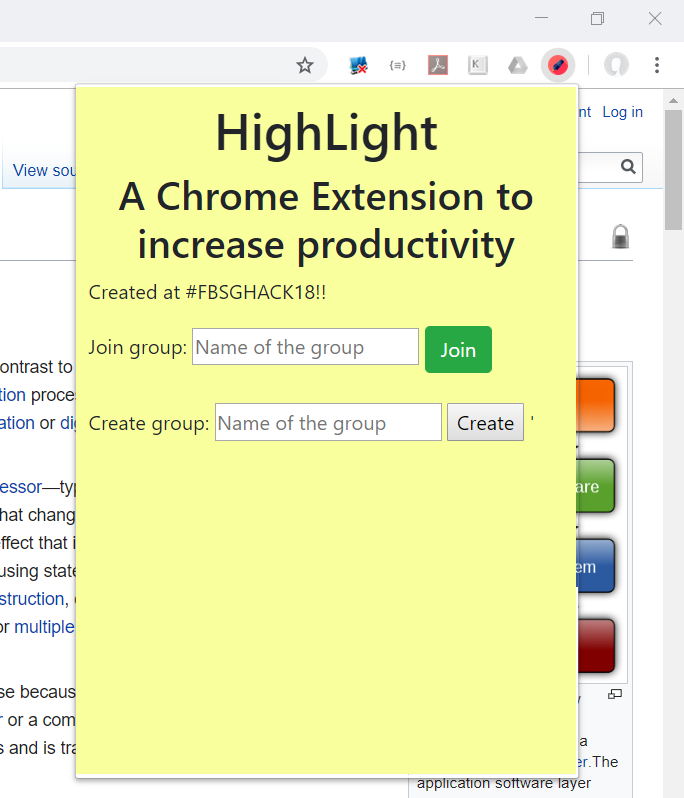
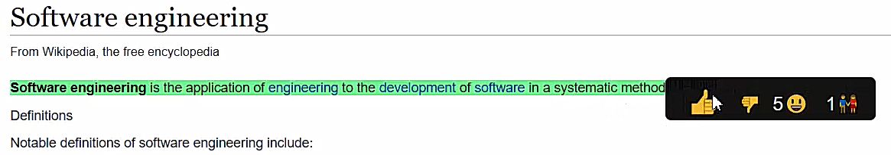
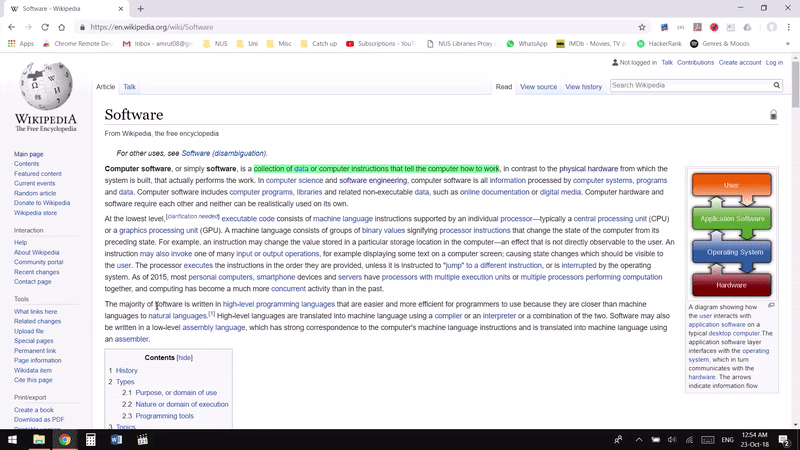

# Fb-hack

Highlight is a Google Chrome extension developed over 20 hours at the Facebook Singapore Hackathon 2018. It is a community-driven software project that uses a user's activity on a webpage to  infer the most important and relevant parts of a webpage. This information, in turn, is used to help future visitors gather the most information from the webpage quickly.

## UI

## HighLight in action

